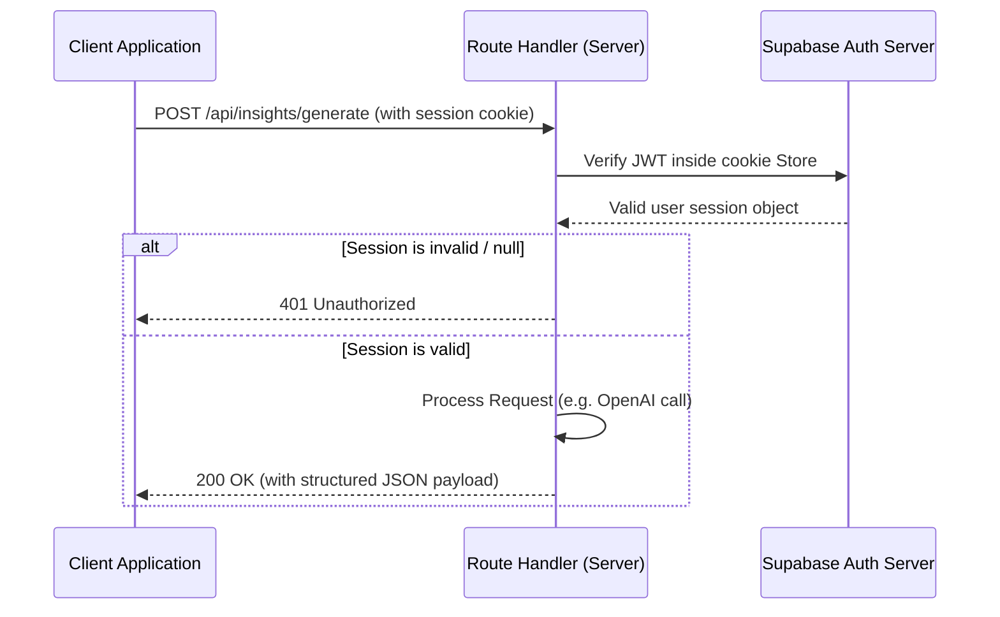

# 📡 API Endpoint Specification & JWT Authentication

This document details the Next.js Route Handlers deployed inside the `/src/app/api` directory, specifying their request schemas, output formats, and the server-side authentication system.

---

## 1. Server-Side Authentication Architecture

All backend route handlers (except pre-authentication utilities like email domain checker) are strictly protected against unauthorized access. They read cookies directly using the standard Next.js `cookies()` header.

### Authentication Helper (`src/utils/supabase/server.ts`)
To instantiate a server-side client inside route handlers or server components, we use `createClient()`. The `getAuthenticatedUser()` helper extracts the current valid session and verifies the user via Supabase.

```typescript
import { createServerClient } from '@supabase/ssr';
import { cookies } from 'next/headers';

export async function createClient() {
  const cookieStore = await cookies();
  return createServerClient(
    process.env.NEXT_PUBLIC_SUPABASE_URL!,
    process.env.NEXT_PUBLIC_SUPABASE_ANON_KEY!,
    {
      cookies: {
        getAll() { return cookieStore.getAll(); },
        setAll(cookiesToSet) {
          try {
            cookiesToSet.forEach(({ name, value, options }) =>
              cookieStore.set(name, value, options)
            );
          } catch {}
        },
      },
    }
  );
}

export async function getAuthenticatedUser() {
  try {
    const supabase = await createClient();
    const { data: { user }, error } = await supabase.auth.getUser();
    if (error || !user) return null;
    return user;
  } catch {
    return null;
  }
}
```

### Flow Verification Diagram



---

## 2. API Endpoints

### 2.1 AI Insights Generation (`POST /api/insights/generate`)
Aggregates the user's unified life dashboard metrics (finances, sports, tasks, career pipeline) and passes them to OpenAI to generate cross-module, daily personal architect highlights.

*   **Security**: Requires authentication session check.
*   **Max Duration**: 25 seconds (Vercel compromise limit).

#### Request Payload
```json
{
  "userContextText": "User Context Profile details including finance records, vitality scores, timeline logs, and active career applications..."
}
```

#### Response (200 OK)
```json
{
  "insights": [
    {
      "title": "Compounding Vitality",
      "description": "Your active workout sessions are up 20% this week compared to last week.",
      "type": "productivity",
      "actionable_advice": "Maintain your 8:00 AM workout slot to solidify this habit loop."
    }
  ]
}
```

---

### 2.2 Investment Analyst Insights (`POST /api/investments/insights`)
Calculates mathematical parameters for a given portfolio mix and formats observations based on asset weights (e.g., crypto, stocks, gold) to help users identify volatility ratios.

*   **Security**: Requires authentication session check.

#### Request Payload
```json
{
  "summary": {
    "totalValue": 15000.00,
    "totalCost": 12000.00,
    "totalChangePercent": 25.00,
    "dailyChangePercent": 1.20,
    "allocationByType": { "stock": 8000, "crypto": 4000, "gold": 3000 },
    "topPerformer": { "symbol": "AAPL", "percentage_change": 45.00 },
    "riskiestBucket": "crypto"
  },
  "positions": [
    { "symbol": "AAPL", "day_change_percent": 0.8 },
    { "symbol": "BTC", "day_change_percent": 3.5 }
  ]
}
```

#### Response (200 OK)
```json
{
  "headline": "Portfolio momentum is constructive with +25.00% gain versus cost basis.",
  "observations": [
    "Your portfolio rose by 1.20% today, reflecting current short-term momentum.",
    "Current allocation is 53% stocks, 27% crypto, and 20% gold."
  ],
  "scenario": "bullish",
  "confidence": "moderate",
  "riskWarning": null
}
```

---

### 2.3 Natural Language Parser (`POST /api/parse`)
Translates structured natural language commands entered in the **Smart Input** box into actionable item payloads.

*   **Security**: Requires authentication session check.

#### Request Payload
```json
{
  "prompt": "spent $15 on lunch today"
}
```

#### Response (200 OK)
```json
{
  "type": "transaction",
  "action": "create",
  "data": {
    "title": "Lunch",
    "amount": 15,
    "transactionType": "expense",
    "date": "2026-05-29",
    "category": "Food"
  },
  "confidence": 0.98,
  "message": "Recognized expense of $15.00 for Lunch."
}
```

---

### 2.4 Email Domain Validator (`POST /api/validate-email`)
Performs pre-signup validation on user email domains using Cloudflare DNS-over-HTTPS.

*   **Security**: Pre-auth public utility (no cookie required).
*   **Timeout**: 5 seconds (fails open to prevent user blocking on network lag).

#### Request Payload
```json
{
  "email": "user@gmail.com"
}
```

#### Response (200 OK)
```json
{
  "valid": true
}
```
*If a disposable domain is entered:*
```json
{
  "valid": false,
  "reason": "Disposable or test email addresses are not allowed"
}
```
*If the domain lacks mail server records:*
```json
{
  "valid": true,
  "warning": "Domain has no mail server (MX) records. Are you sure this email is correct?"
}
```
