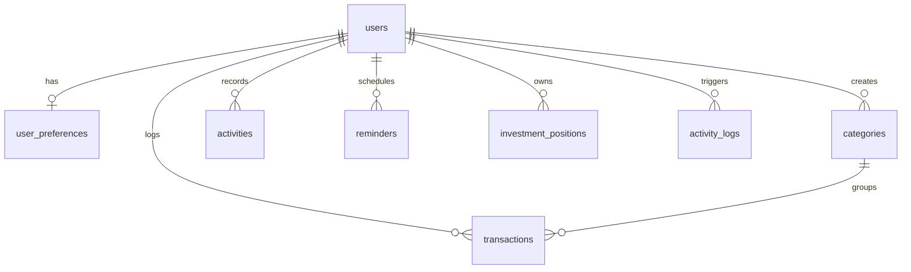

# 🗄️ Database Schema & Security RLS Policies

This document specifies the unified database schema deployed on **Supabase** for the TRASON Life OS dashboard.

---

## 1. Relational Entity Diagram



---

## 2. Table Specifications

### 2.1 Users Table (`public.users`)
Pairs directly with Supabase's `auth.users` schema. Actively synchronized via trigger.

| Column | Type | Constraints | Description |
| :--- | :--- | :--- | :--- |
| `id` | `UUID` | `PRIMARY KEY` | Matches authenticated user ID (`auth.uid()`) |
| `email` | `VARCHAR(255)` | `UNIQUE`, `NOT NULL` | User email address |
| `first_name` | `VARCHAR(100)` | - | First name |
| `last_name` | `VARCHAR(100)` | - | Last name |
| `avatar_url` | `VARCHAR(500)` | - | Link to profile avatar |
| `email_verified`| `BOOLEAN` | `DEFAULT FALSE` | Verification state |
| `phone` | `VARCHAR(20)` | - | User phone contact |
| `bio` | `TEXT` | - | Mini personal bio |
| `created_at` | `TIMESTAMPTZ` | `DEFAULT NOW()` | Record creation timestamp |
| `updated_at` | `TIMESTAMPTZ` | `DEFAULT NOW()` | Record last updated |
| `deleted_at` | `TIMESTAMPTZ` | - | Soft delete anchor |

---

### 2.2 User Preferences (`public.user_preferences`)
Stores personalized configurations for translation modules and metrics.

| Column | Type | Constraints | Description |
| :--- | :--- | :--- | :--- |
| `id` | `UUID` | `PRIMARY KEY` | Unique preference identifier |
| `user_id` | `UUID` | `UNIQUE`, `REFERENCES public.users(id)` | Associated user |
| `theme` | `VARCHAR(50)` | `DEFAULT 'light'` | Theme state (`light`/`dark`/`auto`) |
| `language` | `VARCHAR(10)` | `DEFAULT 'en'` | Active dictionary locale (`en`/`id`/`ja`/`es`) |
| `currency` | `VARCHAR(3)` | `DEFAULT 'USD'` | Local currency format code |
| `timezone` | `VARCHAR(50)` | `DEFAULT 'UTC'` | User standard timezone name |
| `notifications_enabled` | `BOOLEAN` | `DEFAULT TRUE` | Global notifications enable toggle |
| `push_notifications_enabled`| `BOOLEAN` | `DEFAULT TRUE`| Device push notification check |
| `email_digest_enabled` | `BOOLEAN` | `DEFAULT TRUE` | Summary digests check |

---

### 2.3 Categories (`public.categories`)
Groups user financials (`income`/`expense`) with customized styling attributes.

*   **Unique Constraint**: `UNIQUE(user_id, name)` (prevents duplicate categories per user)

| Column | Type | Constraints | Description |
| :--- | :--- | :--- | :--- |
| `id` | `UUID` | `PRIMARY KEY` | Category identifier |
| `user_id` | `UUID` | `REFERENCES public.users(id)` | Creator |
| `name` | `VARCHAR(100)`| `NOT NULL` | Category display title |
| `icon` | `VARCHAR(50)` | - | Lucide icon identifier |
| `color` | `VARCHAR(7)` | - | Hex color code |
| `type` | `VARCHAR(20)` | `CHECK (type IN ('income', 'expense'))`| Category transaction alignment |

---

### 2.4 Transactions (`public.transactions`)
Asset inflows and outflows logged under the **Financial Flow** module.

| Column | Type | Constraints | Description |
| :--- | :--- | :--- | :--- |
| `id` | `UUID` | `PRIMARY KEY` | Transaction identifier |
| `user_id` | `UUID` | `REFERENCES public.users(id)` | Logger |
| `category_id` | `UUID` | `REFERENCES public.categories(id)` | Associated category category |
| `title` | `VARCHAR(255)`| `NOT NULL` | Transaction details description |
| `amount` | `DECIMAL(15,2)`| `CHECK (amount > 0)` | Money value |
| `type` | `VARCHAR(20)` | `CHECK (type IN ('income', 'expense'))`| Cash direction type |
| `date` | `DATE` | `NOT NULL` | Transaction date |

---

### 2.5 Investment Positions (`public.investment_positions`)
Tracked portfolios under the **Investment Analyst** module.

| Column | Type | Constraints | Description |
| :--- | :--- | :--- | :--- |
| `id` | `UUID` | `PRIMARY KEY` | Position identifier |
| `user_id` | `UUID` | `REFERENCES public.users(id)` | Owner |
| `asset_type` | `VARCHAR(20)` | `CHECK (asset_type IN ('stock', 'crypto', 'gold'))`| Asset categorization |
| `symbol` | `VARCHAR(50)` | `NOT NULL` | Ticker identifier |
| `amount` | `DECIMAL(20,8)`| `NOT NULL` | Holding count |
| `buy_price` | `DECIMAL(20,8)`| `NOT NULL` | Purchase price (cost basis) |

---

## 3. Database Triggers & Automations

### 3.1 Auth Account Synchronization
To prevent schema duplication and guarantee fast registration, an automated trigger replicates new credentials directly from Supabase Auth to the public profile table.

```sql
CREATE OR REPLACE FUNCTION public.handle_new_user()
RETURNS TRIGGER SECURITY DEFINER AS $$
BEGIN
  INSERT INTO public.users (id, email)
  VALUES (NEW.id, NEW.email)
  ON CONFLICT (id) DO NOTHING;
  RETURN NEW;
END;
$$ LANGUAGE plpgsql;

CREATE TRIGGER on_auth_user_created
  AFTER INSERT ON auth.users
  FOR EACH ROW EXECUTE FUNCTION public.handle_new_user();
```

---

## 4. Row-Level Security (RLS) Policies

To protect personal details, all schema tables are protected by standard **Row-Level Security** parameters. No user can read, query, update, or delete data belonging to other users.

```sql
-- Enforce RLS on all tables
ALTER TABLE public.users                ENABLE ROW LEVEL SECURITY;
ALTER TABLE public.user_preferences     ENABLE ROW LEVEL SECURITY;
ALTER TABLE public.categories           ENABLE ROW LEVEL SECURITY;
ALTER TABLE public.transactions         ENABLE ROW LEVEL SECURITY;
ALTER TABLE public.activities           ENABLE ROW LEVEL SECURITY;
ALTER TABLE public.reminders            ENABLE ROW LEVEL SECURITY;
ALTER TABLE public.investment_positions ENABLE ROW LEVEL SECURITY;
ALTER TABLE public.activity_logs        ENABLE ROW LEVEL SECURITY;

-- Standard User Separation Policies (isolated by auth.uid() check)
CREATE POLICY "user_all" ON public.users FOR ALL USING (auth.uid() = id);
CREATE POLICY "pref_all" ON public.user_preferences FOR ALL USING (auth.uid() = user_id);
CREATE POLICY "cat_all"  ON public.categories FOR ALL USING (auth.uid() = user_id);
CREATE POLICY "txn_all"  ON public.transactions FOR ALL USING (auth.uid() = user_id);
CREATE POLICY "act_all"  ON public.activities FOR ALL USING (auth.uid() = user_id);
CREATE POLICY "rem_all"  ON public.reminders FOR ALL USING (auth.uid() = user_id);
CREATE POLICY "inv_all"  ON public.investment_positions FOR ALL USING (auth.uid() = user_id);
```
